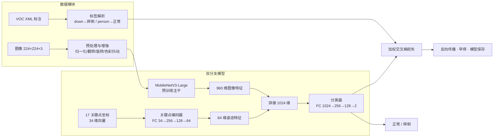

# 🚨 基于 MobileNetV3 与关键点融合的摔倒检测系统

> **深度学习实战项目** | 图像分类 · 姿态识别 · 双分支多模态融合
> 上海杉达学院 · 信息科学与技术学院 | 作者：黄瀚文

一个面向**独居老人安全监护**场景的端到端摔倒检测系统：采用 **MobileNetV3-Large + 关键点编码器** 的双分支中期融合架构，从单张 RGB 图像判断画面中是否存在摔倒行为。系统配套完整的 **数据处理管线、模型训练框架与实时摄像头检测** 三大模块，参数量仅约 **332 万**，具备轻量化、可移植、易部署的特点。

---

## ✨ 项目亮点

- 🧠 **双分支中期融合架构**：图像纹理特征 + 人体骨骼姿态特征在中间层拼接，兼顾全局视觉信息与姿态拓扑信息
- ⚡ **轻量化设计**：MobileNetV3-Large 主干，模型仅约 332 万参数，适合边缘设备部署
- 📦 **完整工程链路**：VOC 标注解析 → 数据增强 → 类别加权训练 → 早停保存 → 推理演示，开箱即用
- 🎥 **实时检测系统**：基于 MediaPipe 姿态估计的规则法实时摔倒检测，支持摄像头流、阈值调节、FPS 显示
- 📊 **严谨的实验分析**：含训练曲线、混淆矩阵、分类报告、ROC 与 Grad-CAM 热力图分析（增强版脚本）
- 🍎 **Apple MPS 硬件加速**：macOS 上自动启用 MPS，无需 CUDA 也能高效训练

---

## 🏗️ 系统架构

### 整体流程



### 模型结构（表）

| 组件 | 结构 | 输出维度 |
|---|---|---|
| 图像分支 | MobileNetV3-Large（ImageNet 预训练，移除分类头） | 960 |
| 关键点编码器 | FC(34→256)→BN→ReLU→Dropout(0.2)→FC(256→128)→BN→ReLU→Dropout(0.2)→FC(128→64) | 64 |
| 特征融合 | 通道维度拼接（Concat） | 1024 |
| 分类器 | FC(1024→256)→BN→ReLU→Dropout(0.3)→FC(256→128)→BN→ReLU→Dropout(0.3)→FC(128→2) | 2 |

---

## 🛠️ 技术栈

| 类别 | 技术 |
|---|---|
| 语言 / 框架 | Python 3.8 · PyTorch 2.x |
| 视觉主干 | MobileNetV3-Large（迁移学习） |
| 姿态估计 | MediaPipe Pose |
| 数据处理 | VOC XML · PIL · NumPy |
| 训练策略 | AdamW · 类别加权交叉熵 · ReduceLROnPlateau · 早停 |
| 可视化 | Matplotlib · Seaborn · Grad-CAM（可选） |
| 硬件加速 | Apple MPS |

---

## 📁 项目结构

```
.
├── FDS                          # 训练脚本：双分支模型 + 完整训练流水线
├── logs/FDS_V2                  # 增强版：ResNet18 对比实验 + ROC + Grad-CAM 热力图
├── webcam_fall_detection.py     # 实时摄像头摔倒检测（MediaPipe 规则法）
├── fix_dataset.py               # 数据集整理工具（配对校验与分层划分）
├── dataset/
│   ├── train/images/            # 训练集：6226 张图像 + 同名 VOC XML 标注
│   └── val/images/              # 验证集：1556 张图像 + 同名 VOC XML 标注
├── checkpoints/                 # 模型权重保存目录
├── logs/                        # 训练曲线与日志输出目录
└── 课程论文.pdf                 # 详细设计文档（20 页）
```

---

## 📊 数据集

- **来源**：公开摔倒行为数据（ModelScope `10142Videos-FallBehaviorData` 视频抽帧）
- **规模**：共 **7,782 张** RGB 图像，室内多场景（不同光照、角度、多人共存）
- **标注**：VOC 格式 XML，`down` 表示摔倒实例，`person` 表示正常实例；图中存在任一 `down` 即判定为摔倒（宽松判定策略）
- **划分**：训练集 6,226 张 / 验证集 1,556 张（约 8:2，按类别分层随机划分，保证图片-标注严格配对）

---

## 🚀 快速开始

### 1️⃣ 环境准备

```bash
conda create -n fall_detection python=3.8
conda activate fall_detection
pip install torch==2.4.1 torchvision==0.19.1
pip install scikit-learn seaborn tqdm matplotlib opencv-python mediapipe==0.10.8
```

### 2️⃣ 训练模型

```bash
python FDS
```

自动完成：数据加载校验 → 标签解析 → 类别权重计算 → 50 轮训练（早停保护）→ 最佳模型保存至 `checkpoints/fall_detection_model.pth` → 输出训练曲线与混淆矩阵。

> 💡 增强实验（MobileNetV3 vs ResNet18 对比 + ROC + Grad-CAM 可视化）：
> ```bash
> python logs/FDS_V2
> ```

### 3️⃣ 实时摄像头检测

```bash
python webcam_fall_detection.py
```

基于 MediaPipe 姿态估计的 6 维几何特征加权评分（身体倾角、躯干高宽比、髋部/头部位置等），支持阈值调节（+/-）、重置（R）、截图（S）、退出（Q）。

---

## 📈 实验结果

在约 7,800 张图像上训练与评估（详见课程论文）：

| 指标 | 数值 |
|---|---|
| 模型参数量 | ≈ 332 万 |
| 验证准确率 | 48.13% |
| 摔倒类召回率 | 57% |
| 摔倒类精确率 | 20% |
| 正常类召回率 | 46% |
| 宏平均 F1 | 0.44 |

> ⚠️ 结果偏低的主要原因（论文中的深度分析）：
> ① 数据集仅有边界框标注、**缺乏骨骼关键点**，关键点分支输入为零向量，模型实际退化为纯图像分类器；
> ② 摔倒样本绝对数量不足，类别不平衡难以完全消除；
> ③ 单帧静态判定无法利用摔倒过程的**运动时序信息**，与躺卧等相似姿态难以区分。

**这恰恰指明了系统的改进路径**（详见下一节），也体现了对实验结果进行归因分析的能力。

---

## 🚀 改进方向（已规划）

1. **激活关键点分支**：引入 MediaPipe / OpenPose 自动提取关键点坐标，无需额外标注即可激活双分支融合的完整能力（项目已内置 MediaPipe 姿态估计能力）
2. **时序建模**：扩展为视频片段分析，引入 LSTM / GRU / 3D-CNN 捕捉帧间运动特征（关节速度、重心加速度）
3. **数据扩充**：整合 URFall、Le2i、MultipleCameras 等公开摔倒数据集，结合背景替换、仿射变换等合成技术扩充少数类
4. **边缘部署**：模型量化、剪枝与知识蒸馏，部署至树莓派等低功耗设备

---

## 📄 论文

《基于 MobileNetV3 与关键点融合的摔倒检测系统设计》（20 页，含完整代码附录与 15 篇参考文献）：
👉 [f23015220黄瀚文-机器学习课程论文.pdf](./f23015220黄瀚文-机器学习课程论文.pdf)

---

## 📬 关于我

深度学习方向学习者，熟悉 **PyTorch / OpenCV / MediaPipe**，关注计算机视觉在**智能安防与智慧养老**场景的落地应用。本项目从数据整理、模型设计到实验分析全程独立完成。
